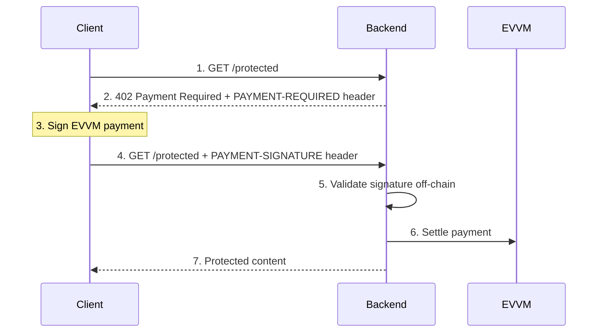

# x402 Demo — Tempo Moderato + EVVM + MPP/purl

A demonstration of the [x402 payment protocol](https://x402.org) with **[@evvm/x402](https://github.com/EVVM-org/x402)** on **Tempo Testnet (Moderato)**, plus a second paid route using **[MPP](https://mpp.dev)** ([`mppx`](https://mpp.dev)) and **[purl](https://github.com/stripe/purl)** for agent-style HTTP clients.

**Integration notes, lessons learned, and troubleshooting:** see [PROJECT_LOG.md](PROJECT_LOG.md).

## Two payment stacks (dual stack)

| Stack | Endpoint | Wire format | Typical client |
| ----- | -------- | ----------- | ---------------- |
| **EVVM x402** | `GET /protected` | `402` + `PAYMENT-REQUIRED` / `PAYMENT-SIGNATURE` ([Coinbase-style x402](https://github.com/coinbase/x402)) | React app + wagmi (browser) |
| **MPP + Tempo** | `GET /mpp/paid` | `402` + `WWW-Authenticate: Payment method="tempo"` ([MPP](https://mpp.dev)) | [purl](https://github.com/stripe/purl), `mppx` clients |

This repo is adapted from [menurivera/x402-demo](https://github.com/menurivera/x402-demo) for **chain 42431** and **ClinicalClaw** (example deployment: `evvmId` **1154**, `evvmCoreAddress` **`0xc37600f8130eca636a7e03a76429682f5188fb30`**). Set your own `PRINCIPAL_TOKEN_ADDRESS` (CCP on Tempo) from deployment artifacts or explorer.

## Architecture (EVVM path)



## Projects

| Project | Port | Description |
| ------- | ---- | ----------- |
| backend | 3000 | Nitro: EVVM x402 + MPP Tempo route |
| client  | 5173 | React + wagmi for EVVM x402 payments |

## Quick start

### Backend

```bash
cd backend
cp .env.example .env
# Edit .env: set RPC (optional), receiver, EVVM core, executor key, PRINCIPAL_TOKEN_ADDRESS, MPP_SECRET_KEY
npm install
npm run dev
```

Generate an MPP secret (example):

```bash
openssl rand -base64 32
```

### Client

```bash
cd client
npm install --legacy-peer-deps
npm run dev
```

Open http://localhost:5173 — connect a wallet on **Tempo Moderato (42431)** and use the UI to pay `/protected`.

Optional: `VITE_RPC_URL` in `client/.env` (defaults to `https://rpc.moderato.tempo.xyz`).

## API endpoints (backend `:3000`)

| Method | Endpoint | Price | Description |
| ------ | -------- | ----- | ----------- |
| GET | `/protected` | EVVM (CCP) | x402 + EVVM `PAYMENT-*` headers |
| GET | `/mpp/paid` | MPP Tempo (default: pathUSD) | MPP `WWW-Authenticate` challenges — use with **purl** |
| GET | `/status` | Free | Server status |

## Prerequisites

1. Node.js 18+
2. Wallet on **Tempo Moderato** (`42431`) for the browser demo
3. **Principal token (CCP)** balance for payers on `PRINCIPAL_TOKEN_ADDRESS` (EVVM path)
4. **Executor** key (`EXECUTOR_PRIVATE_KEY`) funded on Tempo for **gas** (facilitator pays settlement); see [Tempo docs](https://docs.tempo.xyz) for testnet funding (`cast rpc tempo_fundAddress`, public RPC `https://rpc.moderato.tempo.xyz`, fee tokens on Moderato).
5. For **MPP/purl**: a [purl](https://github.com/stripe/purl) wallet with funds on Tempo testnet for the **MPP currency** (default **pathUSD** `0x20c0000000000000000000000000000000000000` — override with `MPP_TEMPO_CURRENCY`).

## purl (agents / CLI)

Install [purl](https://github.com/stripe/purl) (`brew install stripe/purl/purl` or the [install script](https://www.purl.dev)).

```bash
purl wallet add
purl --dry-run http://localhost:3000/mpp/paid
purl http://localhost:3000/mpp/paid
purl inspect http://localhost:3000/mpp/paid
```

## Environment variables

### Backend (`backend/.env`)

See `backend/.env.example`. Important fields:

| Variable | Description |
| -------- | ----------- |
| `RECEIVER_ACCOUNT` | Address receiving EVVM payments (and default MPP recipient) |
| `EVVM_CORE_ADDRESS` | EVVM core contract on Tempo |
| `EXECUTOR_PRIVATE_KEY` | Facilitator / executor private key (settles EVVM payments) |
| `PRINCIPAL_TOKEN_ADDRESS` | CCP / principal TIP-20 token used in EVVM offers |
| `MPP_SECRET_KEY` | Secret for MPP challenge binding (required) |
| `RPC_URL` | Optional; default `https://rpc.moderato.tempo.xyz` |
| `EVVM_ID` | Optional; default `1154` |
| `MPP_TEMPO_CURRENCY` | Optional; default pathUSD on Moderato |
| `MPP_TEMPO_RECIPIENT` | Optional; defaults to `RECEIVER_ACCOUNT` |

### Client

Optional: `VITE_RPC_URL` in `client/.env` (see `client/.env.example`).

Install note: `cd client && npm install --legacy-peer-deps` if RainbowKit peer conflicts with wagmi v3.

## Network configuration

| Parameter | Value |
| --------- | ----- |
| **Chain** | Tempo Testnet (Moderato) |
| **Chain ID** | `42431` |
| **CAIP-2** | `eip155:42431` |
| **RPC** | `https://rpc.moderato.tempo.xyz` (default) |

## Resources

- [x402 Specification](https://github.com/coinbase/x402)
- [@evvm/x402](https://github.com/EVVM-org/x402)
- [EVVM Documentation](https://evvm.info)
- [MPP](https://mpp.dev) · [`mppx`](https://www.npmjs.com/package/mppx)
- [Tempo](https://docs.tempo.xyz)
- [purl](https://github.com/stripe/purl)
